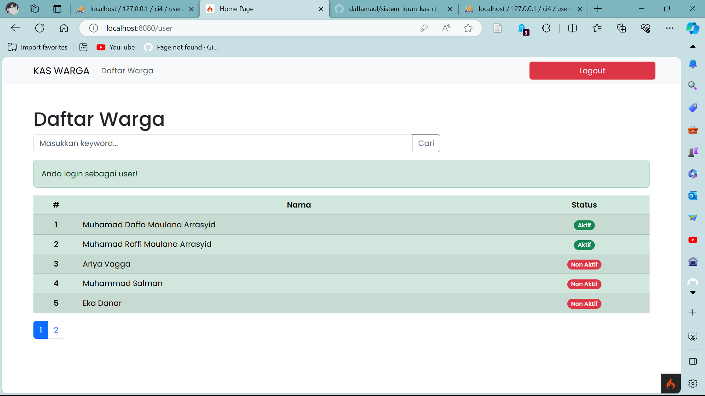
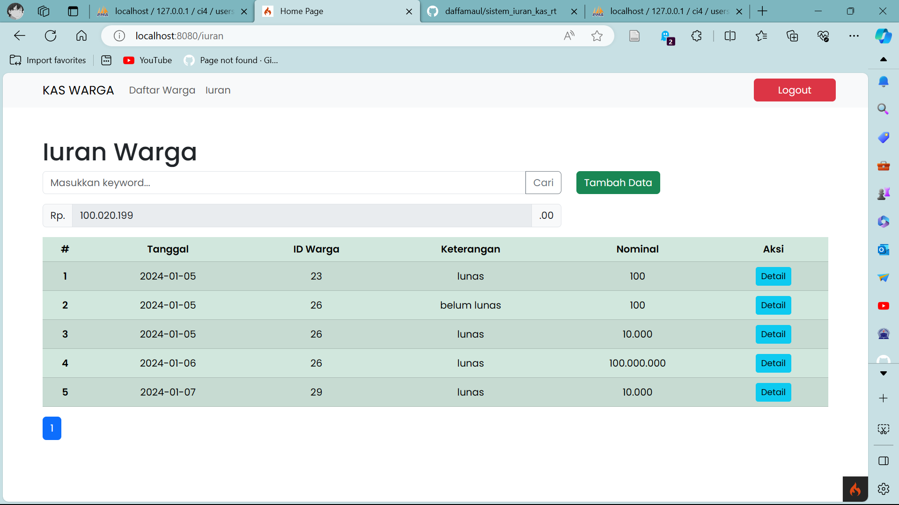

## TI.22.A4

# Profil
| KELOMPOK ? | Sistem Iuran KAS RT                                 |
| --------   | --------------------------------------------------- |
| Gilar Sumilar | 312210407 |
| M. Daffa Maulana |  |
| Abid Lu'ay |  |
| LAPORAN  | [Link]() |
| YouTube  | [Youtube]() |

### Perintah tugas
**Menglola data Warga (CRUD)**
- Menampilkan data Warga
- Tambah Warga
- Ubah dan Hapus Warga

**Transaksi Iuran Warga**
- Daftar KAS Warga
- Tambah Iuran Warga

**Laporan Transaksi**
- Data Warga yang belum membayar Iuran (perbulan/pertahun, dan filter 
jenis_iuran)
- Data Jumlah KAS (bulanan/tahunan)

# Kas Warga: Manajemen Keuangan 
Kas Warga adalah proyek manajemen keuangan berbasis web yang dibangun menggunakan bahasa pemrograman PHP dengan framework CodeIgniter 4.
Proyek ini telah mengimplementasikan fitur-fitur canggih pada bagian backend, termasuk penggunaan session dan dukungan untuk multiuser.

*(**Fitur Utama**)*
- Pencatatan Transaksi: Mudah mencatat dan melacak pemasukan serta pengeluaran keuangan.
- Laporan Keuangan: Lihat laporan keuangan yang komprehensif untuk memonitor kondisi keuangan secara real-time.
- Pengguna Multiuser: Tampilan & fitur yang berbeda antara admin dan user.

## Mengelola data warga (CRUD)

#### *Note :*
Hanya admin yang dapat melakukan CRUD

## Transaksi iuran warga

#### *Note :*
Hanya admin yang dapat melakukan CRUD, terdapat total kas yang terkumpul.

## Laporan transaksi
#### *Note :*
Sudah include dengan `transaksi iuran warga`.

# Database 

 
**[---KEMBALI-->](#Profil)**

